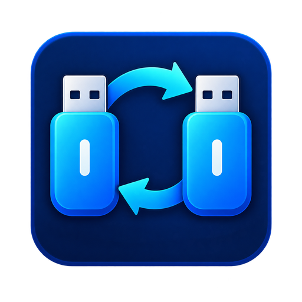

  

# USB Mirror

USB Mirror is a Windows desktop utility for creating complete USB-drive backups and restoring raw disk images.

## Features

- Create a byte-for-byte `.img` backup of a USB drive.
- Write `.img` and hybrid bootable `.iso` images to USB drives.
- Preserve partition tables, boot records, filesystems, and unused sectors in IMG backups.
- Show live imaging progress with cancellation support.
- Show the live percentage in the Windows title and taskbar preview.
- Restrict device selection to USB disks and reject Windows boot/system disks.
- Validate image size and sector alignment before writing.
- Require explicit `ERASE` confirmation for destructive operations.

## Download

Download the latest portable Windows package from [GitHub Releases](https://github.com/satalways/usb-mirror/releases/latest).

Use the ZIP package for normal installation:

1. Download the latest `USB-Mirror-Windows-x64` ZIP package.
2. Extract the complete archive to a folder.
3. Run `usb_mirror.exe` from inside that folder.
4. Approve the Windows administrator prompt.

The separately attached EXE is provided for convenience, but it still requires the DLL and `data` files contained in the ZIP package.

## Requirements

- Windows 10 or Windows 11, 64-bit
- A removable USB disk
- Administrator access

## Important safety information

Writing an IMG or ISO image permanently erases every partition and file on the selected USB disk. Confirm the physical disk name and capacity carefully before proceeding.

USB Mirror creates raw `.img` backups. It does not create ISO 9660/UDF files from USB drives; changing an IMG file's extension to `.iso` would not make it a true ISO image.

## Version history

### Version 1.2.0

- Shows live imaging percentage in the native Windows title, such as `USB Mirror — 47%`.
- Shows `Complete`, `Failed`, or `Canceled` in the title when processing ends.
- Makes progress visible in Alt+Tab and the Windows taskbar preview while using another application.

### Version 1.1.1

- Fixed failures on the final raw-disk read when USB capacity is not an exact multiple of the copy buffer size.
- Added persistent, selectable error details showing the failed processing stage and Windows exception.
- Added diagnostic logs under `%LOCALAPPDATA%\\USB Mirror\\logs`.
- Added checks for insufficient destination space and attempts to save an image onto the USB being backed up.

### Version 1.1.0

- Added an About USB Mirror dialog.
- Displays the installed application version and build number.
- Added a direct link to this public repository for downloads, release notes, and documentation.

### Version 1.0.0

- Initial Windows release.
- Added raw USB-to-IMG backup and IMG/ISO-to-USB restoration.
- Added USB-only device checks, destructive-write confirmation, progress reporting, cancellation, and administrator elevation.

## Source code

The USB Mirror source repository is maintained privately.
